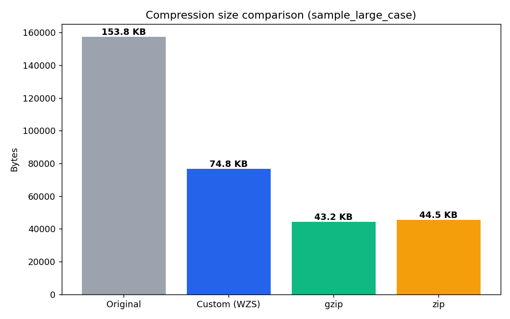
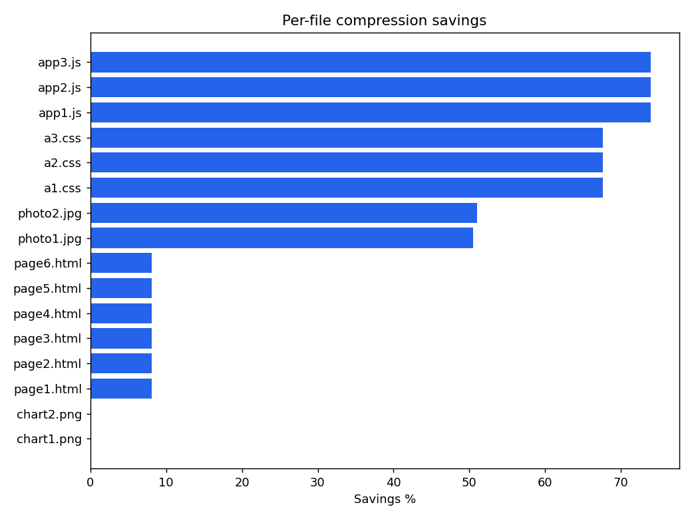
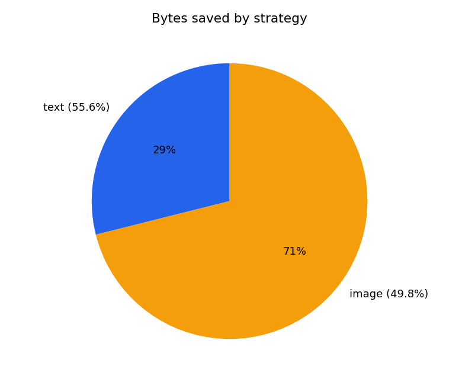

# WebZip Studio

> A desktop compression tool for webpage assets — built from scratch on top of LZ77 + Huffman, implemented as a university Data Structures & Algorithms final project.


---

## What It Does

WebZip Studio takes a folder of webpage files (HTML, CSS, JS, JPG, PNG) and compresses them using a **custom two-stage pipeline**:

- **Text files** → LZ77 sliding-window tokeniser → Huffman entropy coder → `.wzs` binary container
- **Image files** → Pillow re-encoder with user-selectable quality preset (High / Balanced / Strong)

Decompression is lossless for text (verified by SHA-256) and produces the original files exactly.

---

## Demo Numbers

Compressed a 16-file webpage bundle from the included `data/sample_large_case/`:

| Metric | Value |
|---|---|
| Original size | 153.82 KB |
| Compressed size | 74.78 KB |
| Savings | **51.4%** |
| Compression ratio | 0.486 |
| Time (custom pipeline) | 97.7 ms |
| Text files (12) | 41.10 KB → 18.25 KB (55.6% saved) |
| Image files (4) | 112.71 KB → 56.53 KB (49.8% saved) |

---

## Screenshots

| Compress tab | Analytics tab | Visualizer tab |
|---|---|---|
|  |  |  |

---

## Features

- **Auto-strategy** — selects text or image pipeline by file extension
- **Batch compression** — single file, multiple files, or an entire folder in one click
- **Custom `.wzs` container** — carries the LZ77 frequency table + Huffman bitstream with a `WZS1` magic header
- **Integrity checking** — SHA-256 hash stored in the manifest; decompression verifies every text file
- **Baseline comparison** — side-by-side ratio vs gzip and ZIP
- **Transfer simulation** — 4G / 5G / WiFi estimated transfer time for compressed vs original
- **Algorithm visualiser** — inspect top LZ77 tokens, the Huffman code book, and match lengths
- **Incremental compression** — SHA-256 cache skips unchanged files on repeated runs
- **CLI + GUI** — full five-tab PySide6 desktop app _and_ a headless command-line interface

---

## Data Structures Used

| Structure | Where |
|---|---|
| **Hash map** | LZ77 3-byte prefix index, Huffman frequency table, manifest |
| **Min-heap (priority queue)** | Building the Huffman tree from frequency counts |
| **Binary tree** | Storing Huffman codes for encode/decode |
| **Sliding window** | LZ77 look-back buffer |
| **Queue (`deque`)** | Batch file processing in the manager |
| **Set** | Deduplication, incremental change detection |

---

## Tech Stack

| Layer | Technology |
|---|---|
| Language | Python 3.10 |
| GUI | PySide6 (Qt6) |
| Image processing | Pillow |
| Compression algorithms | Implemented from scratch (no zlib) |
| Archive format | Custom `.wzs` + standard ZIP wrapper |
| Testing | `unittest` (custom runner) |

---

## How to Run

### Desktop GUI

```bash
pip install -r requirements.txt
python main.py
```

The window opens five tabs: **Compress → Decompress → Analytics → Visualizer → Incremental**.

### Command Line

```bash
# Compress a folder
python -m src.cli compress data/sample_webpage -o build/sample_pkg --preset Balanced

# Decompress (accepts folder or .webzip archive)
python -m src.cli decompress build/sample_pkg.webzip -o build/sample_restored

# Verify integrity of a restored package
python -m src.cli verify build/sample_pkg build/sample_restored
```

### Tests

```bash
python tests/run_all.py
```

---

## Project Layout

```
WebZipStudio/
  main.py                  # GUI entry point
  requirements.txt
  src/
    algorithms/            # huffman.py, lz77.py  ← core data structures
    core/                  # archive, comparison, incremental, integrity,
    │                      # manifest, metrics, strategy, transfer pipelines
    gui/                   # PySide6 main window + 5 tabs
    utils/                 # formatting helpers
  data/
    sample_webpage/        # small demo (HTML/CSS/JS/images)
    sample_large_case/     # 16-file batch used for the README numbers
  docs/                    # SYSTEM_DESIGN, COMPLEXITY_ANALYSIS, TEST_PLAN, DEFENSE_QA
  tests/                   # unit + integration tests
  assets/                  # comparison charts
```

---

## Architecture

```
User input (files / folder)
        │
        ▼
  StrategySelector (hash map: ext → strategy)
    ├── "text"  ──▶  LZ77 encoder ──▶ Huffman coder ──▶ .wzs file
    └── "image" ──▶  Pillow re-encoder ──▶ compressed jpg/png
        │
        ▼
  Manifest (JSON) + IncrementalCache + MetricsCollector
        │
        ▼
  Package folder  ──▶  .webzip archive (standard ZIP wrapper)
```

Compression and decompression run on `QThread` workers so the UI stays responsive during large batches.

---

## What I Learned

- Implementing LZ77 and Huffman from scratch revealed exactly *why* real compressors (Deflate = LZ77 + Huffman) work so well — and where the constant-factor overhead of a Python implementation bites
- Designing the `.wzs` binary format taught me how to embed metadata (frequency table) needed to reconstruct the decoder on the other side without a separate dictionary file
- Threading a PySide6 GUI with `QThread` signal/slot proved much cleaner than locking shared state — the UI never blocks even on large folders
- SHA-256 integrity checking showed why a manifest hash is safer than a CRC for tamper detection

---

## My Role

Solo implementation of the compression algorithms, CLI, test suite, and GUI architecture. Team members (Alen Bakbergen, Diego David Huang Liu) contributed the analytics charts, sample data, and the project report.

---

## Team

| Member | Student ID |
|---|---|
| Bakbergen Amir | 202469990559 |
| Bakbergen Alen | 202469990562 |
| Huang Liu Diego David | 202469990549 |

*Final project — Data Structures and its Algorithms course*
